# ChaosReplay

## Overview

ChaosReplay is designed to become an end-to-end distributed failure reconstruction and fix-verification platform. Modern microservice and distributed systems suffer from rare, non-deterministic, and cascading failures that are notoriously difficult to capture, isolate, and debug.

ChaosReplay's long-term vision is to automatically ingest distributed runtime telemetry, correlate cross-service events into deterministic execution timelines, reconstruct production incidents into minimal reproducible failure scenarios, replay them inside isolated environments with deterministic fault injection, and verify candidate code fixes before production release.

> **Note**: ChaosReplay is being developed in deliberate engineering phases. The current codebase implements **Phase 1 — Foundation**, **Phase 2 — Telemetry Ingestion**, **Phase 3 — Telemetry Correlation & Failure Reconstruction**, **Phase 4 — Deterministic Failure Replay & Scenario Generation**, **Phase 5 — Replay Verification & Failure Comparison**, and **Phase 6 — Deterministic Failure Analysis & Root-Cause Evidence**. Future capabilities (service dependency graphs, minimal reproduction engine, chaos injection, incident graphs, UI dashboards) will be built incrementally in subsequent phases.

---

## Problem

Reproducing production bugs and catastrophic incidents in distributed systems is one of the hardest problems in software engineering:

1. **Non-Deterministic Concurrency**: Many failures occur only under specific race conditions, network latency spikes, or cross-service event orderings that cannot be reproduced on local developer machines.
2. **Cascading State Corruption**: A failure in an upstream dependency often propagates silently through messaging queues and caches, surfacing symptoms in completely unrelated downstream services.
3. **Environment Parity Gaps**: Staging environments rarely replicate the traffic volume, data topology, or network dynamics required to trigger transient edge-case failures.
4. **Verification Uncertainty**: Developers attempting to fix complex distributed bugs lack a reliable method to prove that a candidate patch genuinely solves the failure mode without introducing subtle regressions under identical fault conditions.

---

## Current Status

**Current Status: Phase 6 — Deterministic Failure Analysis & Root-Cause Evidence**

Phase 6 transforms ChaosReplay from a system that verifies replay executions into an explainable, evidence-backed failure analysis platform:

> **"Why did the failure occur, which services and operations contributed, and what is the deterministic evidence supporting this conclusion?"**

* **Evidence-Only & Explainable**: ChaosReplay **never invents, guesses, or hallucinates** a root cause using LLMs or speculative heuristics. Every conclusion is strictly traceable to persisted `TelemetryEvent` records, `ReplayScenario` snapshots, and `ReplayVerificationDifference` records.
* **Insufficient Evidence Guarantee**: If no failures occurred in a trace or evidence is lacking, the system returns `status: INSUFFICIENT_EVIDENCE` and `conclusion: NO_FAILURE_OBSERVED` with confidence score `0.0`.
* **Deterministic Analysis Identity**: Analysis IDs are deterministically derived via SHA-256 over trace ID, event IDs, timestamps, services, event types, severities, scenario ID, verification ID, and verification differences (`analysis-<32-char-hex>`).
* **Idempotent Analysis Execution**: Repeating an analysis against identical trace and verification data returns `200 OK` with the existing analysis record without creating duplicate entries. Fresh analyses return `201 Created`.
* **Candidate Cause Taxonomy**:
  * `DATABASE_FAILURE`: Operation on database component failed (base confidence: 0.85).
  * `EXTERNAL_DEPENDENCY_FAILURE`: Outbound external network/HTTP call failed (base confidence: 0.85).
  * `TIMEOUT`: Explicit timeout indicator in message, operation, or metadata (base confidence: 0.80).
  * `APPLICATION_ERROR`: Internal application exception or software defect (base confidence: 0.70).
  * `SERVICE_FAILURE`: Unspecified service failure (base confidence: 0.65).
  * `DOWNSTREAM_FAILURE`: Failure in later service occurring after upstream failure in same trace (base confidence: 0.55).
  * `UNKNOWN_FAILURE`: Fallback when cause cannot be determined (base confidence: 0.30).
* **Supporting Evidence Taxonomy**:
  * `FIRST_FAILURE`: Earliest failure observed in trace execution (+0.05 bonus).
  * `TEMPORAL_PRECEDENCE`: Chronological precedence over subsequent failures (+0.03 bonus).
  * `ERROR_EVENT` / `FATAL_EVENT`: Verified failure severity in telemetry.
  * `DATABASE_ERROR` / `EXTERNAL_CALL_ERROR` / `TIMEOUT_SIGNAL`: Operation-specific evidence.
  * `DOWNSTREAM_ERROR` / `SERVICE_PROPAGATION`: Cross-service cascade evidence.
  * `REPLAY_MISMATCH`: Behavioral divergence detected during replay verification (+0.05 bonus).
* **Deterministic Scoring & Tie-Breaking**: Candidates are ranked by:
  1. Confidence score (`DESC`)
  2. First observed timestamp (`ASC`)
  3. Sequence number (`ASC`)
  4. Event ID (`ASC`)
  5. Service name (`ASC`)
  6. Candidate type name (`ASC`)
* **Flyway V4 Migration**: Version-controlled `V4__create_failure_analyses.sql` establishing `failure_analyses`, `failure_analysis_candidates`, and `failure_analysis_evidence` with foreign-key cascades, check constraints, and unique indexes.
* **Comprehensive Automated Tests**: 134 automated tests spanning unit tests (Mockito), MVC slice tests (`@WebMvcTest`), and real PostgreSQL 16 Testcontainers integration tests.

---

## Architecture

The end-to-end processing pipeline in Phase 6 is:

```mermaid
flowchart TD
    TelemetryProducer["Telemetry Producer / Microservices"]
    
    subgraph SpringBootApp["ChaosReplay Platform (port 8080)"]
        direction TB
        subgraph IngestionLayer["Ingestion Layer"]
            TelemetryAPI["Telemetry Controller<br/>POST /api/v1/telemetry/events<br/>GET /api/v1/telemetry/events"]
            TelemetrySvc["Telemetry Ingestion Service"]
        end
        
        subgraph CorrelationLayer["Correlation & Reconstruction Layer"]
            TraceAPI["Trace Correlation Controller<br/>GET /api/v1/traces/{traceId}<br/>GET /api/v1/traces/{traceId}/reconstruction"]
            CorrelationSvc["Trace Correlation Service"]
        end
        
        subgraph ReplayLayer["Replay & Scenario Generation Layer"]
            ReplayAPI["Replay Scenario Controller<br/>POST /api/v1/replay/scenarios/traces/{traceId}<br/>GET /api/v1/replay/scenarios/{scenarioId}<br/>POST /api/v1/replay/scenarios/{scenarioId}/execute"]
            ScenarioSvc["Replay Scenario Generator<br/>Idempotent & Deterministic SHA-256"]
            SimulationEngine["Replay Simulation Engine<br/>Safe In-Memory Simulation"]
        end

        subgraph VerificationLayer["Verification & Comparison Layer"]
            VerifyAPI["Replay Verification Controller<br/>POST /api/v1/replay/scenarios/{scenarioId}/verify<br/>GET /api/v1/replay/verifications/{verificationId}<br/>GET /api/v1/replay/scenarios/{scenarioId}/verifications"]
            VerifySvc["Replay Verification Engine<br/>Deterministic Sequence Alignment"]
        end

        subgraph AnalysisLayer["Failure Analysis & Root-Cause Layer"]
            AnalysisAPI["Failure Analysis Controller<br/>POST /api/v1/analysis/traces/{traceId}<br/>GET /api/v1/analysis/{analysisId}<br/>GET /api/v1/analysis/traces/{traceId}"]
            AnalysisSvc["Failure Analysis Service<br/>Deterministic Candidate & Evidence Engine"]
        end
        
        subgraph PersistenceLayer["Persistence Layer (Spring Data JPA + Flyway)"]
            RepoTelemetry["TelemetryEventRepository"]
            RepoScenario["ReplayScenarioRepository"]
            RepoScenarioEvent["ReplayScenarioEventRepository"]
            RepoVerify["ReplayVerificationRepository"]
            RepoVerifyDiff["ReplayVerificationDifferenceRepository"]
            RepoAnalysis["FailureAnalysisRepository"]
            RepoCandidate["FailureAnalysisCandidateRepository"]
            RepoEvidence["FailureAnalysisEvidenceRepository"]
        end
        
        TelemetryAPI --> TelemetrySvc
        TelemetrySvc --> RepoTelemetry
        
        TraceAPI --> CorrelationSvc
        CorrelationSvc --> RepoTelemetry
        
        ReplayAPI --> ScenarioSvc
        ReplayAPI --> SimulationEngine
        ScenarioSvc --> RepoTelemetry
        ScenarioSvc --> RepoScenario
        ScenarioSvc --> RepoScenarioEvent
        SimulationEngine --> RepoScenario
        SimulationEngine --> RepoScenarioEvent

        VerifyAPI --> VerifySvc
        VerifySvc --> RepoScenario
        VerifySvc --> RepoScenarioEvent
        VerifySvc --> RepoVerify
        VerifySvc --> RepoVerifyDiff

        AnalysisAPI --> AnalysisSvc
        AnalysisSvc --> RepoTelemetry
        AnalysisSvc --> RepoScenario
        AnalysisSvc --> RepoVerify
        AnalysisSvc --> RepoVerifyDiff
        AnalysisSvc --> RepoAnalysis
        AnalysisSvc --> RepoCandidate
        AnalysisSvc --> RepoEvidence
    end
    
    subgraph Storage["Database (PostgreSQL 16)"]
        TableTelemetry[("telemetry_events<br/>Immutable source of truth")]
        TableScenarios[("replay_scenarios<br/>Deterministic scenarios")]
        TableScenarioEvents[("replay_scenario_events<br/>Sequence & relative offsets (JSONB)")]
        TableVerifications[("replay_verifications<br/>Deterministic verification records")]
        TableDifferences[("replay_verification_differences<br/>Granular difference line items")]
        TableAnalyses[("failure_analyses<br/>Deterministic failure analysis records")]
        TableCandidates[("failure_analysis_candidates<br/>Ranked candidate causes")]
        TableEvidence[("failure_analysis_evidence<br/>Supporting telemetry & verification evidence")]
    end
    
    TelemetryProducer -->|"POST Telemetry"| TelemetryAPI
    RepoTelemetry --> TableTelemetry
    RepoScenario --> TableScenarios
    RepoScenarioEvent --> TableScenarioEvents
    RepoVerify --> TableVerifications
    RepoVerifyDiff --> TableDifferences
    RepoAnalysis --> TableAnalyses
    RepoCandidate --> TableCandidates
    RepoEvidence --> TableEvidence
```



---

## Failure Analysis Flow & Evidence Model

```text
Original Telemetry (Immutable)
       ↓
Trace Correlation & Failure Reconstruction
       ↓
Replay Scenario (Expected Snapshots)
       ↓
Replay Simulation & Verification Differences
       ↓
Deterministic Failure Analysis Engine
       ├── Failure Event Filtering (Single-Counted)
       ├── Candidate Cause Classification (Taxonomy-driven)
       ├── Supporting Evidence Assembly (Temporal, Operation, Severity, Replay)
       ├── Deterministic Confidence Scoring (Base + Bounded Bonuses)
       ├── Deterministic Ranking & Tie-Breaking
       └── Root Cause vs Multiple Causes Conclusion Formulation
       ↓
COMPLETED (ROOT_CAUSE_CANDIDATE | MULTIPLE_POSSIBLE_CAUSES)
  or INSUFFICIENT_EVIDENCE (NO_FAILURE_OBSERVED)
       ↓
Immutable Analysis Persistence (PostgreSQL)
```

---

## Failure Analysis & Root-Cause Endpoints (Phase 6)

### 1. Execute Deterministic Failure Analysis for Trace
Analyzes a correlated trace alongside any generated scenario and replay verification differences to produce a deterministic, evidence-backed failure analysis with ranked candidates.
Idempotent: returns `201 Created` for fresh analyses, `200 OK` for repeated identical runs.

* **Endpoint**: `POST /api/v1/analysis/traces/{traceId}`
* **Response Codes**: `201 Created`, `200 OK`, `404 Not Found`

**Example Request**:
```bash
curl -i -X POST http://localhost:8080/api/v1/analysis/traces/analysis-trace-001
```

**Response (`201 Created` / `200 OK`)**:
```json
{
  "analysisId": "analysis-8da3440a5f68579f81885b6455a916f1",
  "traceId": "analysis-trace-001",
  "scenarioId": "scen-ea0f04e52e2d285ae2808937c9f0189f",
  "verificationId": "verify-64b944c033c63df3fbb2eac14d2311f5",
  "status": "COMPLETED",
  "conclusion": "ROOT_CAUSE_CANDIDATE",
  "confidenceScore": 0.9600,
  "eventCount": 3,
  "failureCount": 2,
  "candidateCount": 2,
  "primaryServiceName": "payment-service",
  "primaryEventId": "live-evt-002",
  "summary": "Primary failure candidate: DATABASE_FAILURE in payment-service at event live-evt-002. Database operation 'UPDATE accounts' reported failure. Evaluated 2 candidate causes with conclusion: ROOT_CAUSE_CANDIDATE.",
  "candidates": [
    {
      "rank": 1,
      "serviceName": "payment-service",
      "eventId": "live-evt-002",
      "eventType": "DATABASE",
      "severity": "ERROR",
      "candidateType": "DATABASE_FAILURE",
      "confidenceScore": 0.9600,
      "firstObservedAt": "2026-09-23T10:00:00.050Z",
      "description": "DATABASE_FAILURE in payment-service at event live-evt-002. First failure observed in trace execution.",
      "evidence": [
        {
          "sequenceNumber": 2,
          "eventId": "live-evt-002",
          "evidenceType": "FIRST_FAILURE",
          "evidenceValue": "Earliest failure observed in trace execution at sequence #2"
        },
        {
          "sequenceNumber": 2,
          "eventId": "live-evt-002",
          "evidenceType": "TEMPORAL_PRECEDENCE",
          "evidenceValue": "Event preceded all subsequent failures in trace"
        },
        {
          "sequenceNumber": 2,
          "eventId": "live-evt-002",
          "evidenceType": "ERROR_EVENT",
          "evidenceValue": "Event logged with ERROR severity"
        },
        {
          "sequenceNumber": 2,
          "eventId": "live-evt-002",
          "evidenceType": "DATABASE_ERROR",
          "evidenceValue": "Database operation reported failure: UPDATE accounts"
        }
      ]
    },
    {
      "rank": 2,
      "serviceName": "order-service",
      "eventId": "live-evt-003",
      "eventType": "REQUEST",
      "severity": "ERROR",
      "candidateType": "DOWNSTREAM_FAILURE",
      "confidenceScore": 0.5800,
      "firstObservedAt": "2026-09-23T10:00:00.120Z",
      "description": "DOWNSTREAM_FAILURE in order-service at event live-evt-003. Observed subsequently during trace execution.",
      "evidence": [
        {
          "sequenceNumber": 3,
          "eventId": "live-evt-003",
          "evidenceType": "ERROR_EVENT",
          "evidenceValue": "Event logged with ERROR severity"
        },
        {
          "sequenceNumber": 3,
          "eventId": "live-evt-003",
          "evidenceType": "DOWNSTREAM_ERROR",
          "evidenceValue": "Failure occurred in downstream service after initial failure in payment-service"
        },
        {
          "sequenceNumber": 3,
          "eventId": "live-evt-003",
          "evidenceType": "SERVICE_PROPAGATION",
          "evidenceValue": "Potential downstream propagation from payment-service to order-service"
        },
        {
          "sequenceNumber": 3,
          "eventId": "live-evt-003",
          "evidenceType": "TEMPORAL_PRECEDENCE",
          "evidenceValue": "Event followed earlier failure event live-evt-002"
        }
      ]
    }
  ],
  "createdAt": "2026-09-23T15:58:48.757256Z"
}
```

---

### 2. Retrieve Failure Analysis by ID
Retrieves an existing analysis record with all ranked candidate causes and supporting evidence.

* **Endpoint**: `GET /api/v1/analysis/{analysisId}`
* **Response Codes**: `200 OK`, `404 Not Found`

**Example Request**:
```bash
curl http://localhost:8080/api/v1/analysis/analysis-8da3440a5f68579f81885b6455a916f1
```

---

### 3. Retrieve Latest Analysis for Trace
Retrieves the most recent failure analysis associated with a distributed trace.

* **Endpoint**: `GET /api/v1/analysis/traces/{traceId}`
* **Response Codes**: `200 OK`, `404 Not Found`

**Example Request**:
```bash
curl http://localhost:8080/api/v1/analysis/traces/analysis-trace-001
```

---

### 4. Retrieve Complete Analysis History for Trace
Retrieves all historical analyses executed for a distributed trace ordered by creation time descending.

* **Endpoint**: `GET /api/v1/analysis/traces/{traceId}/history`
* **Response Codes**: `200 OK`, `404 Not Found`

**Example Request**:
```bash
curl http://localhost:8080/api/v1/analysis/traces/analysis-trace-001/history
```

---

## Verification Endpoints (Phase 5)

### 1. Verify Replay Scenario
Verifies a simulated scenario against original telemetry. Idempotent: returns `201 Created` for fresh verifications, `200 OK` for repeated identical runs.

* **Endpoint**: `POST /api/v1/replay/scenarios/{scenarioId}/verify`
* **Response Codes**: `201 Created`, `200 OK`, `404 Not Found`

**Example Request**:
```bash
curl -i -X POST http://localhost:8080/api/v1/replay/scenarios/scen-02f5e6e297e2f440a066464a29f0a50e/verify
```

**Response (`201 Created` / `200 OK`)**:
```json
{
  "verificationId": "verify-d54f9a530b9468ff85f5611d8b168b71",
  "scenarioId": "scen-02f5e6e297e2f440a066464a29f0a50e",
  "status": "PASSED",
  "originalEventCount": 4,
  "replayedEventCount": 4,
  "originalFailureCount": 2,
  "replayedFailureCount": 2,
  "originalDurationMs": 200,
  "replayedDurationMs": 200,
  "eventsMatched": 4,
  "eventsMissing": 0,
  "eventsUnexpected": 0,
  "severityMismatches": 0,
  "eventTypeMismatches": 0,
  "serviceMismatches": 0,
  "resultMessage": "Replay verified successfully: all 4 events matched original failure characteristics",
  "createdAt": "2026-09-23T15:32:46.888986Z",
  "differences": []
}
```

---

### 2. Retrieve Verification by ID
Retrieves an existing verification record with all detailed differences.

* **Endpoint**: `GET /api/v1/replay/verifications/{verificationId}`
* **Response Codes**: `200 OK`, `404 Not Found`

**Example Request**:
```bash
curl http://localhost:8080/api/v1/replay/verifications/verify-d54f9a530b9468ff85f5611d8b168b71
```

---

### 3. Retrieve Verification History for Scenario
Retrieves all verification attempts for a specific scenario ordered by creation time descending.

* **Endpoint**: `GET /api/v1/replay/scenarios/{scenarioId}/verifications`
* **Response Codes**: `200 OK`, `404 Not Found`

**Example Request**:
```bash
curl http://localhost:8080/api/v1/replay/scenarios/scen-02f5e6e297e2f440a066464a29f0a50e/verifications
```

---

## Replay & Scenario Endpoints (Phase 4)

* `POST /api/v1/replay/scenarios/traces/{traceId}`: Generates deterministic scenario (`201 Created`, `200 OK`, `404 Not Found`).
* `GET /api/v1/replay/scenarios/{scenarioId}`: Retrieves replay scenario (`200 OK`, `404 Not Found`).
* `POST /api/v1/replay/scenarios/{scenarioId}/execute`: Executes safe simulation (`200 OK`, `404 Not Found`, `409 Conflict`).
* `GET /api/v1/replay/scenarios/traces/{traceId}`: Retrieves all scenarios for a trace (`200 OK`).

---

## Telemetry & Correlation Endpoints (Phases 1–3)

* `POST /api/v1/telemetry/events`: Ingests telemetry event (`201 Created`, `409 Conflict`).
* `GET /api/v1/telemetry/events`: Multi-criteria querying with pagination.
* `GET /api/v1/traces/{traceId}`: Correlates trace events chronologically (`200 OK`, `404 Not Found`).
* `GET /api/v1/requests/{requestId}`: Correlates ingress request events (`200 OK`, `404 Not Found`).
* `GET /api/v1/traces/{traceId}/reconstruction`: Reconstructs trace duration, failure metrics, and first failure (`200 OK`, `404 Not Found`).
* `GET /api/v1/health`: Heartbeat health check.
* `GET /actuator/health`: Production health probe reporting database connectivity.

---

## Automated Testing Suite

Run the full automated test suite (134 tests including Testcontainers PostgreSQL integration tests):

```bash
./mvnw clean test
```

### Test Hierarchy:
1. **Unit Tests**:
   - `FailureAnalysisServiceTest`: 18 unit tests verifying candidate cause classification (database, external dependency, timeout, application error, downstream failure), evidence attachment (first failure, temporal precedence, replay mismatch bonus, explicit metadata), deterministic tie-breaking, bounded confidence scoring, idempotent repeat retrieval, zero-failure clean trace handling (`INSUFFICIENT_EVIDENCE`), and immutability guarantees.
   - `ReplayVerificationServiceTest`: 16 unit tests covering PASSED, FAILED (missing events, unexpected events, severity mismatch, event type mismatch, service mismatch, failure count drift), PARTIAL (non-critical severity differences), deterministic SHA-256 ID consistency, idempotency, and scenario immutability.
   - `ReplayScenarioServiceTest`: Deterministic SHA-256 scenario ID generation, relative `offset_ms` computation, single-counted failure analysis, tie-breaking order preservation, and idempotency.
   - `ReplayExecutionServiceTest`: Safe simulation execution, status lifecycle transitions (`CREATED -> RUNNING -> COMPLETED`), failure counting, and conflict prevention on concurrent runs.
   - `TraceCorrelationServiceTest`: Trace/request correlation and failure timeline reconstruction.
   - `TelemetryServiceTest`: Duplicate rejection, concurrency constraints, and query filtering.
2. **Web Slice Tests (`@WebMvcTest`)**:
   - `FailureAnalysisControllerTest`: Verifies HTTP 201/200 idempotency, 404 handling for unknown analysis/trace, and analysis history listing.
   - `ReplayVerificationControllerTest`: Verifies HTTP 201/200 idempotency, 404 handling, and verification history listing.
   - `ReplayScenarioControllerTest`: HTTP 201/200 idempotency, 404 handling, and 409 conflict responses.
   - `TraceCorrelationControllerTest`, `RequestCorrelationControllerTest`, `TelemetryControllerTest`, `HealthControllerTest`, `ValidationTest`.
3. **Real PostgreSQL Integration Tests (`@Testcontainers`)**:
   - `FailureAnalysisPostgresIntegrationTest`: Verifies Flyway V4 migration, analysis persistence, candidate persistence, evidence persistence, foreign-key cascade deletion, unique constraints (`analysis_id` and `(analysis_id, rank)`), clean trace handling, and full end-to-end pipeline (Telemetry -> Ingestion -> Correlation -> Scenario Generation -> Execution -> Verification -> Failure Analysis) against live PostgreSQL 16.
   - `ReplayVerificationPostgresIntegrationTest`: Verifies Flyway V3 migration, verification persistence, difference persistence, foreign-key cascade deletion, unique constraints, and end-to-end verification against live PostgreSQL 16.
   - `ReplayPostgresIntegrationTest`: Flyway V2 migrations, foreign keys, JSONB metadata persistence, sequence uniqueness constraints, and simulation lifecycle updates.
   - `CorrelationPostgresIntegrationTest`, `TelemetryPostgresIntegrationTest`.

---

## Packaging & Docker

### Package JAR:
```bash
./mvnw clean package
```

### Build Production Docker Image:
```bash
docker build -t chaosreplay:latest .
```

---

## Project Roadmap

* **Phase 1 — Foundation** *(Completed)*
* **Phase 2 — Telemetry Ingestion** *(Completed)*
* **Phase 3 — Telemetry Correlation & Failure Reconstruction** *(Completed)*
* **Phase 4 — Deterministic Failure Replay & Scenario Generation** *(Completed)*
* **Phase 5 — Replay Verification & Failure Comparison** *(Completed)*
* **Phase 6 — Deterministic Failure Analysis & Root-Cause Evidence** *(Completed)*
* **Phase 7 — Service Dependency Graph** *(Upcoming)*
* **Phase 8 — Minimal Reproduction Engine** *(Upcoming)*
* **Phase 9 — Isolated Replay Engine** *(Upcoming)*
* **Phase 10 — Chaos Injection** *(Upcoming)*
* **Phase 11 — Candidate Fix Verification** *(Upcoming)*
* **Phase 12 — Observability (OTel/Prometheus/Grafana)** *(Upcoming)*
* **Phase 13 — Angular Incident Dashboard** *(Upcoming)*
* **Phase 14 — Kubernetes/AWS Deployment** *(Upcoming)*