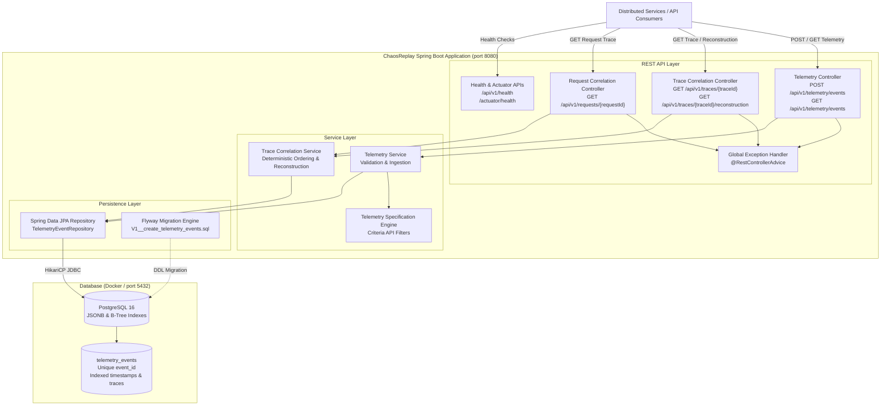

# ChaosReplay

## Overview

ChaosReplay is designed to become an end-to-end distributed failure reconstruction and fix-verification platform. Modern microservice and distributed systems suffer from rare, non-deterministic, and cascading failures that are notoriously difficult to capture, isolate, and debug.

ChaosReplay's long-term vision is to automatically ingest distributed runtime telemetry, correlate cross-service events into deterministic execution timelines, reconstruct production incidents into minimal reproducible failure scenarios, replay them inside isolated environments with deterministic fault injection, and verify candidate code fixes before production release.

> **Note**: ChaosReplay is being developed in deliberate engineering phases. The current codebase implements **Phase 1 — Foundation**, **Phase 2 — Telemetry Ingestion**, and **Phase 3 — Telemetry Correlation & Failure Reconstruction**. Future capabilities (service dependency graphs, replay engine, chaos injection, incident graphs, UI dashboards) will be built incrementally in subsequent phases.

---

## Problem

Reproducing production bugs and catastrophic incidents in distributed systems is one of the hardest problems in software engineering:

1. **Non-Deterministic Concurrency**: Many failures occur only under specific race conditions, network latency spikes, or cross-service event orderings that cannot be reproduced on local developer machines.
2. **Cascading State Corruption**: A failure in an upstream dependency often propagates silently through messaging queues and caches, surfacing symptoms in completely unrelated downstream services.
3. **Environment Parity Gaps**: Staging environments rarely replicate the traffic volume, data topology, or network dynamics required to trigger transient edge-case failures.
4. **Verification Uncertainty**: Developers attempting to fix complex distributed bugs lack a reliable method to prove that a candidate patch genuinely solves the failure mode without introducing subtle regressions under identical fault conditions.

---

## Current Status

**Current Status: Phase 3 — Telemetry Correlation & Failure Reconstruction**

Phase 3 builds upon the telemetry ingestion foundation to reconstruct distributed execution traces and analyze failure lifecycles:

* **Distributed Trace Correlation (`GET /api/v1/traces/{traceId}`)**: Assembles all telemetry events belonging to a distributed trace across services, sorted deterministically by occurrence timestamp ascending (`timestamp ASC, event_id ASC`). Computes trace-level aggregates: `eventCount`, `hasErrors`, `highestSeverity`, and ordered distinct `services`.
* **Ingress Request Correlation (`GET /api/v1/requests/{requestId}`)**: Groups telemetry events by single ingress request identifier to isolate end-to-end request lifecycles.
* **Deterministic Failure Reconstruction (`GET /api/v1/traces/{traceId}/reconstruction`)**: Reconstructs the complete execution timeline and computes exact duration metrics (`startTime`, `endTime`, `durationMs`). Automatically detects failures (`severity == ERROR || severity == FATAL || eventType == ERROR`), counts unique failure events, and isolates the precise `firstFailure` event in chronological order without speculative root-cause guessing.
* **Consistent 404 Not Found Semantics**: Missing traces or requests return standardized `404 Not Found` error envelopes.
* **Non-Mutating Pure Aggregation**: Telemetry entities remain immutable; correlation and reconstruction are purely query-time aggregations.
* **Real Database Integration Testing**: Tested end-to-end against real PostgreSQL 16 via Testcontainers, verifying database-level deterministic tie-breaking and timeline reconstruction.

---

## Architecture

The following diagram illustrates the Phase 3 system architecture:



---

## Telemetry Domain Model

Every field in the `TelemetryEvent` model is purposefully designed to support distributed tracing and failure reconstruction:

| Field | Type | Required | Description & Role in Reconstruction |
| :--- | :--- | :--- | :--- |
| `id` | `BIGSERIAL` | Auto | Internal database surrogate primary key for efficient indexing. |
| `eventId` | `VARCHAR(64)` | Yes | Unique producer-assigned identifier with unique constraint. Serves as tie-breaker for identical timestamps. |
| `timestamp` | `TIMESTAMPTZ` | Yes | Precise UTC event occurrence time at producer. Forms chronological sorting baseline (`timestamp ASC`). |
| `serviceName` | `VARCHAR(100)` | Yes | Originating microservice identifier (e.g. `order-service`). Tracks involved services in order of appearance. |
| `serviceInstance`| `VARCHAR(100)` | No | Specific node/pod/instance ID (e.g. `order-node-01`). Pinpoints failing replica. |
| `eventType` | `VARCHAR(32)` | Yes | Controlled category: `REQUEST`, `RESPONSE`, `ERROR`, `LOG`, `DATABASE`, `EXTERNAL_CALL`. `ERROR` triggers failure condition. |
| `severity` | `VARCHAR(20)` | Yes | Controlled level: `DEBUG`, `INFO`, `WARN`, `ERROR`, `FATAL`. Levels `ERROR` and `FATAL` trigger failure condition. |
| `traceId` | `VARCHAR(64)` | No | Distributed trace identifier linking cross-service operations. Primary key for trace correlation. |
| `requestId` | `VARCHAR(64)` | No | Ingress HTTP/RPC request identifier for operation scoping. |
| `operation` | `VARCHAR(255)` | No | Operation name or HTTP endpoint (e.g. `POST /payments`, `SELECT users`). |
| `message` | `TEXT` | No | Human-readable log or diagnostic message. |
| `metadata` | `JSONB` | No | Arbitrary contextual key-value payload (e.g. latencies, parameters, headers) stored as native JSONB. |
| `createdAt` | `TIMESTAMPTZ` | Auto | Database record insertion timestamp in UTC (system audit trail). |

---

## API Reference

### 1. Ingest Telemetry Event

Ingests a single telemetry event into the system.

* **Endpoint**: `POST /api/v1/telemetry/events`
* **Content-Type**: `application/json`
* **Response Code**: `201 Created`

**Request Example**:

```bash
curl -X POST http://localhost:8080/api/v1/telemetry/events \
  -H "Content-Type: application/json" \
  -d '{
    "eventId": "evt-001",
    "timestamp": "2026-09-21T15:30:00Z",
    "serviceName": "payment-service",
    "serviceInstance": "payment-01",
    "eventType": "ERROR",
    "severity": "ERROR",
    "traceId": "trace-123",
    "requestId": "req-456",
    "operation": "POST /payments",
    "message": "Payment provider timeout",
    "metadata": {
      "provider": "stripe",
      "timeoutMs": 5000
    }
  }'
```

**Success Response (`201 Created`)**:

```json
{
  "id": 1,
  "eventId": "evt-001",
  "timestamp": "2026-09-21T15:30:00Z",
  "serviceName": "payment-service",
  "serviceInstance": "payment-01",
  "eventType": "ERROR",
  "severity": "ERROR",
  "traceId": "trace-123",
  "requestId": "req-456",
  "operation": "POST /payments",
  "message": "Payment provider timeout",
  "metadata": {
    "provider": "stripe",
    "timeoutMs": 5000
  },
  "createdAt": "2026-09-21T15:30:01.123456Z"
}
```

---

### 2. Query Telemetry Events

Queries telemetry events with multi-criteria filtering and bounded pagination. Results are sorted by `timestamp DESC`.

* **Endpoint**: `GET /api/v1/telemetry/events`
* **Query Parameters**: `serviceName`, `eventType`, `severity`, `traceId`, `requestId`, `from`, `to`, `page`, `size`
* **Response Code**: `200 OK`

---

### 3. Correlate Trace Events

Retrieves all telemetry events belonging to a distributed trace, ordered chronologically (`timestamp ASC, event_id ASC`).

* **Endpoint**: `GET /api/v1/traces/{traceId}`
* **Response Code**: `200 OK` (or `404 Not Found`)

**Example Request**:

```bash
curl http://localhost:8080/api/v1/traces/trace-123
```

**Response (`200 OK`)**:

```json
{
  "traceId": "trace-123",
  "eventCount": 3,
  "hasErrors": true,
  "highestSeverity": "ERROR",
  "services": [
    "api-gateway",
    "order-service",
    "payment-service"
  ],
  "events": [
    {
      "id": 1,
      "eventId": "evt-001",
      "timestamp": "2026-09-21T15:30:00Z",
      "serviceName": "api-gateway",
      "serviceInstance": "gw-01",
      "eventType": "REQUEST",
      "severity": "INFO",
      "traceId": "trace-123",
      "requestId": "req-456",
      "operation": "POST /checkout",
      "message": "Incoming checkout request",
      "metadata": null,
      "createdAt": "2026-09-21T15:30:00.123456Z"
    },
    {
      "id": 2,
      "eventId": "evt-002",
      "timestamp": "2026-09-21T15:30:01Z",
      "serviceName": "order-service",
      "serviceInstance": "ord-01",
      "eventType": "REQUEST",
      "severity": "INFO",
      "traceId": "trace-123",
      "requestId": "req-456",
      "operation": "POST /orders",
      "message": "Validating order",
      "metadata": null,
      "createdAt": "2026-09-21T15:30:01.123456Z"
    },
    {
      "id": 3,
      "eventId": "evt-003",
      "timestamp": "2026-09-21T15:30:02Z",
      "serviceName": "payment-service",
      "serviceInstance": "pay-01",
      "eventType": "EXTERNAL_CALL",
      "severity": "ERROR",
      "traceId": "trace-123",
      "requestId": "req-456",
      "operation": "POST /charge",
      "message": "Payment provider timeout",
      "metadata": { "provider": "stripe", "timeoutMs": 5000 },
      "createdAt": "2026-09-21T15:30:02.123456Z"
    }
  ]
}
```

---

### 4. Correlate Request Events

Retrieves all telemetry events scoped to a specific ingress request, ordered chronologically.

* **Endpoint**: `GET /api/v1/requests/{requestId}`
* **Response Code**: `200 OK` (or `404 Not Found`)

**Example Request**:

```bash
curl http://localhost:8080/api/v1/requests/req-456
```

---

### 5. Reconstruct Trace Execution Timeline

Reconstructs the execution timeline, duration metrics, and deterministic failure diagnostics for a trace.

* **Endpoint**: `GET /api/v1/traces/{traceId}/reconstruction`
* **Response Code**: `200 OK` (or `404 Not Found`)

**Example Request**:

```bash
curl http://localhost:8080/api/v1/traces/trace-123/reconstruction
```

**Response (`200 OK`)**:

```json
{
  "traceId": "trace-123",
  "eventCount": 3,
  "services": [
    "api-gateway",
    "order-service",
    "payment-service"
  ],
  "startTime": "2026-09-21T15:30:00Z",
  "endTime": "2026-09-21T15:30:02Z",
  "durationMs": 2000,
  "hasFailure": true,
  "failureCount": 1,
  "firstFailure": {
    "eventId": "evt-003",
    "serviceName": "payment-service",
    "serviceInstance": "pay-01",
    "timestamp": "2026-09-21T15:30:02Z",
    "eventType": "EXTERNAL_CALL",
    "severity": "ERROR",
    "operation": "POST /charge",
    "message": "Payment provider timeout"
  },
  "timeline": [
    {
      "id": 1,
      "eventId": "evt-001",
      "timestamp": "2026-09-21T15:30:00Z",
      "serviceName": "api-gateway",
      "serviceInstance": "gw-01",
      "eventType": "REQUEST",
      "severity": "INFO",
      "traceId": "trace-123",
      "requestId": "req-456",
      "operation": "POST /checkout",
      "message": "Incoming checkout request",
      "metadata": null,
      "createdAt": "2026-09-21T15:30:00.123456Z"
    },
    {
      "id": 2,
      "eventId": "evt-002",
      "timestamp": "2026-09-21T15:30:01Z",
      "serviceName": "order-service",
      "serviceInstance": "ord-01",
      "eventType": "REQUEST",
      "severity": "INFO",
      "traceId": "trace-123",
      "requestId": "req-456",
      "operation": "POST /orders",
      "message": "Validating order",
      "metadata": null,
      "createdAt": "2026-09-21T15:30:01.123456Z"
    },
    {
      "id": 3,
      "eventId": "evt-003",
      "timestamp": "2026-09-21T15:30:02Z",
      "serviceName": "payment-service",
      "serviceInstance": "pay-01",
      "eventType": "EXTERNAL_CALL",
      "severity": "ERROR",
      "traceId": "trace-123",
      "requestId": "req-456",
      "operation": "POST /charge",
      "message": "Payment provider timeout",
      "metadata": { "provider": "stripe", "timeoutMs": 5000 },
      "createdAt": "2026-09-21T15:30:02.123456Z"
    }
  ]
}
```

**Unknown Trace Error Response (`404 Not Found`)**:

```json
{
  "timestamp": "2026-09-21T15:35:00.000000Z",
  "status": 404,
  "error": "NOT_FOUND",
  "message": "Trace not found: unknown-trace-id",
  "path": "/api/v1/traces/unknown-trace-id"
}
```

---

### 6. Service Health Endpoints

* `GET /api/v1/health`: Basic service operational heartbeat.
* `GET /actuator/health`: Production health probe reporting database connectivity, connection pool status, and disk space.

---

## Technology Stack

The technologies implemented in Phases 1, 2 & 3 are:

* **Language**: Java 21 (LTS)
* **Framework**: Spring Boot 3.4.2
* **Web Layer**: Spring Web (Spring MVC)
* **Operational Monitoring**: Spring Boot Actuator
* **Database & ORM**: PostgreSQL 16, Spring Data JPA, Hibernate 6 (`JSONB` mapping via `@JdbcTypeCode`)
* **Database Migrations**: Flyway 10
* **Connection Pooling**: HikariCP
* **Validation**: Jakarta Bean Validation (Hibernate Validator)
* **Build Tool**: Apache Maven (via Maven Wrapper `mvnw`)
* **Testing**: JUnit 5, Spring Boot Test, Mockito, MockMvc, AssertJ, Testcontainers PostgreSQL
* **Containerization**: Docker (multi-stage build), Docker Compose

---

## Local Setup & Execution

### Prerequisites

* Java 21 JDK installed
* Docker and Docker Compose installed

### 1. Start PostgreSQL Container

```bash
docker compose up -d
docker compose ps
```

### 2. Run the Application

```bash
./mvnw spring-boot:run
```

The application starts on port `8080`, automatically executes Flyway migrations against PostgreSQL, and initializes HikariCP.

---

## Automated Testing Suite

Run the full automated test suite (48 tests including Testcontainers PostgreSQL integration tests):

```bash
./mvnw clean test
```

### Test Hierarchy:
1. **Unit Tests (`TelemetryServiceTest`, `TraceCorrelationServiceTest`)**: Fast business logic tests verifying duplicate detection, concurrency constraint propagation, query parameter validation, trace/request correlation, duration calculation, and deterministic first-failure extraction with Mockito.
2. **Web Slice Tests (`TelemetryControllerTest`, `TraceCorrelationControllerTest`, `RequestCorrelationControllerTest`, `HealthControllerTest`, `ValidationTest`)**: Controller slice tests verifying HTTP contracts, JSON serialization/deserialization, 404 error envelopes, bean validation, and parameter binding via MockMvc.
3. **PostgreSQL Integration Tests (`TelemetryPostgresIntegrationTest`, `CorrelationPostgresIntegrationTest`)**: Real end-to-end database tests against PostgreSQL 16 via Testcontainers, verifying Flyway migration execution, `JSONB` column mapping, unique index enforcement, database-level sorting (`ORDER BY timestamp ASC, event_id ASC`), and multi-service timeline reconstruction.

---

## Packaging & Docker

### Package JAR:

```bash
./mvnw clean package
```

### Build Production Docker Image:

```bash
docker build -t chaosreplay:latest .
```

---

## Project Roadmap

* **Phase 1 — Foundation** *(Completed)*
* **Phase 2 — Telemetry Ingestion** *(Completed)*
* **Phase 3 — Telemetry Correlation & Failure Reconstruction** *(Completed)*
* **Phase 4 — Service Dependency Graph** *(Upcoming)*
* **Phase 5 — Minimal Reproduction Engine** *(Upcoming)*
* **Phase 6 — Isolated Replay Engine** *(Upcoming)*
* **Phase 7 — Chaos Injection** *(Upcoming)*
* **Phase 8 — Candidate Fix Verification** *(Upcoming)*
* **Phase 9 — Observability (OTel/Prometheus/Grafana)** *(Upcoming)*
* **Phase 10 — Angular Incident Dashboard** *(Upcoming)*
* **Phase 11 — Kubernetes/AWS Deployment** *(Upcoming)*