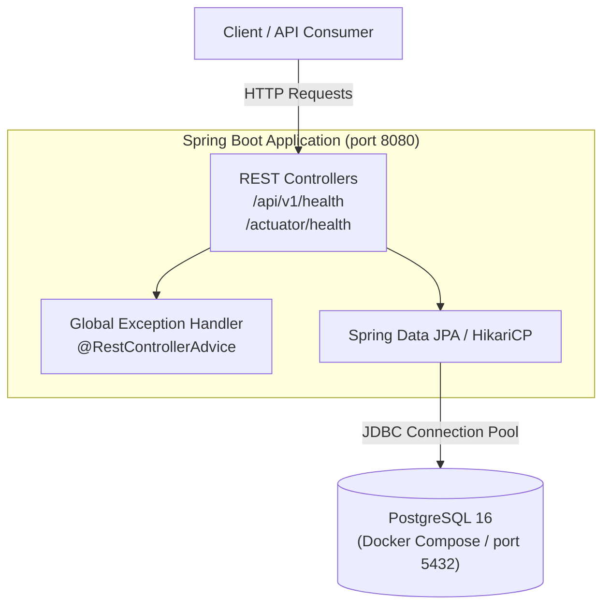

# ChaosReplay

## Overview

ChaosReplay is designed to become an end-to-end distributed failure reconstruction and fix-verification platform. Modern microservice and distributed systems suffer from rare, non-deterministic, and cascading failures that are notoriously difficult to capture, isolate, and debug. 

ChaosReplay's long-term vision is to automatically ingest distributed runtime telemetry, reconstruct production incidents into minimal reproducible failure scenarios, replay them inside isolated environments with deterministic fault injection, and verify candidate code fixes before production release.

> **Note**: ChaosReplay is being developed in deliberate engineering phases. The current codebase implements **Phase 1 — Foundation** only. Future capabilities (telemetry pipelines, replay engine, chaos injection, incident graphs, UI dashboards) will be built incrementally in subsequent phases.

---

## Problem

Reproducing production bugs and catastrophic incidents in distributed systems is one of the hardest problems in software engineering:

1. **Non-Deterministic Concurrency**: Many failures occur only under specific race conditions, network latency spikes, or cross-service event orderings that cannot be reproduced on local developer machines.
2. **Cascading State Corruption**: A failure in an upstream dependency often propagates silently through messaging queues and caches, surfacing symptoms in completely unrelated downstream services.
3. **Environment Parity Gaps**: Staging environments rarely replicate the traffic volume, data topology, or network dynamics required to trigger transient edge-case failures.
4. **Verification Uncertainty**: Developers attempting to fix complex distributed bugs lack a reliable method to prove that a candidate patch genuinely solves the failure mode without introducing subtle regressions under identical fault conditions.

---

## Current Status

**Current Status: Phase 1 — Foundation**

Phase 1 establishes the production-grade engineering foundation for the backend platform:

* **Spring Boot Application Architecture**: Structured with Java 21, Spring Boot 3.4, constructor-based dependency injection, and clean package separation.
* **Health & Diagnostics API**: Typed endpoints (`/api/v1/health` and `/actuator/health`) reporting system availability and readiness.
* **Database Foundation**: Spring Data JPA and PostgreSQL connection pool configuration ready for local development and containerization, parameterized via environment variables.
* **Centralized Error Handling**: Global exception handler (`@RestControllerAdvice`) producing consistent, typed API error envelopes without leaking sensitive stack traces.
* **Input Validation**: Reusable Jakarta Bean Validation integrated with automated error mapping.
* **Local Containerization**: Multi-stage production `Dockerfile` with non-root security and a `docker-compose.yml` configuration managing isolated PostgreSQL storage.
* **Automated Test Suite**: Independent, fast unit and API integration tests requiring no external database or embedded mock substitutes.

---

## Architecture

The following diagram illustrates the current Phase 1 foundation architecture:



---

## Technology Stack

The technologies implemented in Phase 1 are:

* **Language**: Java 21 (LTS)
* **Framework**: Spring Boot 3.4.2
* **Web Layer**: Spring Web (Spring MVC)
* **Operational Monitoring**: Spring Boot Actuator
* **Data Persistence**: Spring Data JPA, Hibernate, PostgreSQL JDBC Driver
* **Connection Pooling**: HikariCP
* **Validation**: Jakarta Bean Validation (Hibernate Validator)
* **Build Tool**: Apache Maven (via Maven Wrapper `mvnw`)
* **Testing**: JUnit 5, Spring Boot Test, MockMvc, AssertJ
* **Containerization**: Docker (multi-stage build), Docker Compose

---

## Local Setup

### Prerequisites

* Java 21 JDK installed
* Docker and Docker Compose installed

### 1. Clone the Repository

```bash
git clone https://github.com/mohammedbilal09/chaos-replay.git
cd chaos-replay
```

### 2. Configure Environment Variables

The application comes with sensible local development defaults. To override them, create a `.env` file from the provided `.env.example`:

```bash
cp .env.example .env
```

Key environment variables:

| Variable | Description | Default |
| :--- | :--- | :--- |
| `POSTGRES_HOST` | Hostname for PostgreSQL instance | `localhost` |
| `POSTGRES_PORT` | Port exposed by PostgreSQL | `5432` |
| `POSTGRES_DB` | Database name | `chaosreplay` |
| `POSTGRES_USER` | Database username | `chaosreplay` |
| `POSTGRES_PASSWORD` | Database password | `chaosreplay` |
| `JAVA_OPTS` | JVM memory and GC flags (for Docker) | `-XX:+UseG1GC -XX:MaxRAMPercentage=75.0` |

### 3. Start PostgreSQL Database

Start the PostgreSQL service using Docker Compose:

```bash
docker compose up -d
```

Verify that the database container is healthy:

```bash
docker compose ps
```

### 4. Run the Spring Boot Application

Run the application using the Maven wrapper with the `local` profile:

```bash
./mvnw spring-boot:run
```

The application will start on port `8080` and establish a connection pool to the local PostgreSQL container.

---

## API

### 1. Service Health Endpoint

Returns the operational status and service identifier.

* **Endpoint**: `GET /api/v1/health`
* **Response Code**: `200 OK`
* **Content-Type**: `application/json`

**Example Response**:

```json
{
  "status": "UP",
  "service": "chaosreplay"
}
```

### 2. Spring Boot Actuator Health Endpoint

Returns application availability and component health status (including PostgreSQL connectivity when running under the local profile).

* **Endpoint**: `GET /actuator/health`
* **Response Code**: `200 OK`
* **Content-Type**: `application/json`

**Example Response**:

```json
{
  "status": "UP",
  "components": {
    "db": {
      "status": "UP",
      "details": {
        "database": "PostgreSQL",
        "validationQuery": "isValid()"
      }
    },
    "diskSpace": {
      "status": "UP"
    },
    "ping": {
      "status": "UP"
    }
  }
}
```

### 3. Error Response Structure

All unhandled exceptions and validation errors return a consistent, typed JSON payload:

```json
{
  "timestamp": "2026-09-21T15:30:00.000Z",
  "status": 400,
  "error": "BAD_REQUEST",
  "message": "probeName must not be blank",
  "path": "/test/validation"
}
```

---

## Testing

Execute the automated test suite using the Maven wrapper:

```bash
./mvnw test
```

The automated test suite runs under the `test` profile, executing isolated unit and API slice tests independently without requiring external database dependencies.

---

## Build

Compile, test, and package the executable JAR:

```bash
./mvnw clean package
```

To package the JAR without running tests:

```bash
./mvnw clean package -DskipTests
```

### Build and Run with Docker

To build the multi-stage production Docker image:

```bash
docker build -t chaosreplay:latest .
```

To run the containerized application:

```bash
docker run -p 8080:8080 --name chaosreplay-app chaosreplay:latest
```

---

## Roadmap

* **Phase 1 — Foundation** *(Completed)*
* **Phase 2 — Telemetry Ingestion**
* **Phase 3 — Event Correlation**
* **Phase 4 — Incident Reconstruction**
* **Phase 5 — Service Dependency Graph**
* **Phase 6 — Minimal Reproduction Engine**
* **Phase 7 — Isolated Replay Engine**
* **Phase 8 — Chaos Injection**
* **Phase 9 — Candidate Fix Verification**
* **Phase 10 — Observability**
* **Phase 11 — Angular Incident Dashboard**
* **Phase 12 — Kubernetes/AWS Deployment**