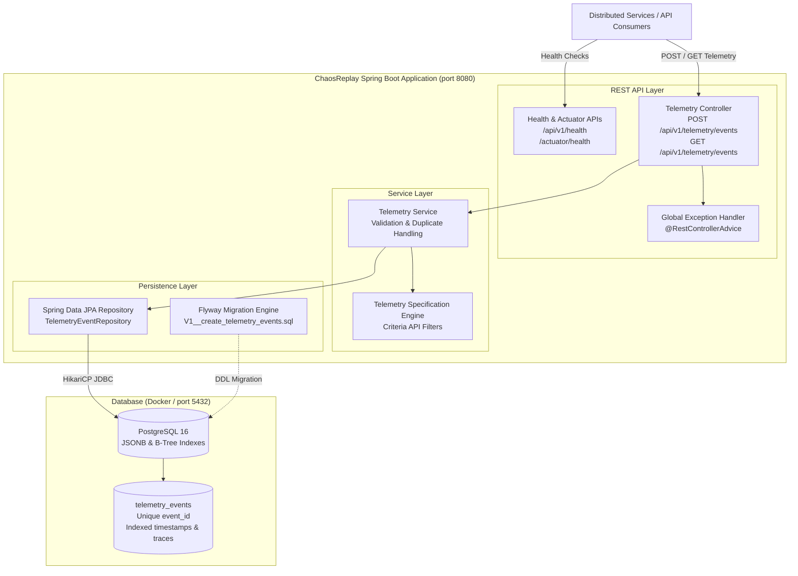

# ChaosReplay

## Overview

ChaosReplay is designed to become an end-to-end distributed failure reconstruction and fix-verification platform. Modern microservice and distributed systems suffer from rare, non-deterministic, and cascading failures that are notoriously difficult to capture, isolate, and debug.

ChaosReplay's long-term vision is to automatically ingest distributed runtime telemetry, reconstruct production incidents into minimal reproducible failure scenarios, replay them inside isolated environments with deterministic fault injection, and verify candidate code fixes before production release.

> **Note**: ChaosReplay is being developed in deliberate engineering phases. The current codebase implements **Phase 1 — Foundation** and **Phase 2 — Telemetry Ingestion**. Future capabilities (event correlation, replay engine, chaos injection, incident graphs, UI dashboards) will be built incrementally in subsequent phases.

---

## Problem

Reproducing production bugs and catastrophic incidents in distributed systems is one of the hardest problems in software engineering:

1. **Non-Deterministic Concurrency**: Many failures occur only under specific race conditions, network latency spikes, or cross-service event orderings that cannot be reproduced on local developer machines.
2. **Cascading State Corruption**: A failure in an upstream dependency often propagates silently through messaging queues and caches, surfacing symptoms in completely unrelated downstream services.
3. **Environment Parity Gaps**: Staging environments rarely replicate the traffic volume, data topology, or network dynamics required to trigger transient edge-case failures.
4. **Verification Uncertainty**: Developers attempting to fix complex distributed bugs lack a reliable method to prove that a candidate patch genuinely solves the failure mode without introducing subtle regressions under identical fault conditions.

---

## Current Status

**Current Status: Phase 2 — Telemetry Ingestion**

Phase 2 introduces the first core domain capability of ChaosReplay — ingesting, validating, persisting, and querying distributed telemetry events:

* **Domain Model & Persistence**: Real `TelemetryEvent` entity mapped to PostgreSQL via Spring Data JPA and Hibernate 6.
* **Flyway Database Migrations**: Version-controlled, deterministic database schema migration (`V1__create_telemetry_events.sql`) with schema validation (`ddl-auto: validate`).
* **Optimized Index Architecture**: Targeted B-tree indexes for chronological sorting, service filtering, distributed tracing (`trace_id`), request correlation (`request_id`), and error triage (`event_type, severity`).
* **JSONB Structured Metadata**: Rich contextual metadata stored as native PostgreSQL `JSONB` via Hibernate `@JdbcTypeCode(SqlTypes.JSON)`, avoiding brittle Java serialization blobs.
* **Two-Tier Duplicate Protection**: Fast application-level check (`existsByEventId`) combined with authoritative database `UNIQUE` constraint on `event_id` to safeguard against concurrent race conditions (returning `409 Conflict`).
* **Dynamic Specification Querying & Pagination**: Composable Criteria API specifications (`JpaSpecificationExecutor`) supporting multi-attribute filtering with bounded pagination (`PagedResponse`).
* **Comprehensive Automated Tests**: Unit tests with Mockito, API slice tests (`@WebMvcTest`), and real PostgreSQL integration tests using Testcontainers.

---

## Architecture

The following diagram illustrates the Phase 2 system architecture:



---

## Telemetry Domain Model

Every field in the `TelemetryEvent` model is purposefully designed to support future failure reconstruction:

| Field | Type | Required | Description & Future Phase Purpose |
| :--- | :--- | :--- | :--- |
| `id` | `BIGSERIAL` | Auto | Internal database surrogate primary key for efficient indexing. |
| `eventId` | `VARCHAR(64)` | Yes | Unique producer-assigned identifier with unique constraint. Guarantees deduplication. |
| `timestamp` | `TIMESTAMPTZ` | Yes | Precise UTC event occurrence time at producer (distinct from DB insertion time). Crucial for timeline reconstruction. |
| `serviceName` | `VARCHAR(100)` | Yes | Originating microservice identifier (e.g. `order-service`). Forms service dependency graph nodes. |
| `serviceInstance`| `VARCHAR(100)` | No | Specific node/pod/instance ID (e.g. `order-node-01`). Identifies replica-specific state corruption. |
| `eventType` | `VARCHAR(32)` | Yes | Controlled category: `REQUEST`, `RESPONSE`, `ERROR`, `LOG`, `DATABASE`, `EXTERNAL_CALL`. |
| `severity` | `VARCHAR(20)` | Yes | Controlled level: `DEBUG`, `INFO`, `WARN`, `ERROR`, `FATAL`. Enables threshold filtering during triage. |
| `traceId` | `VARCHAR(64)` | No | Distributed trace identifier linking cross-service operations in Phase 3 (Event Correlation). |
| `requestId` | `VARCHAR(64)` | No | Ingress HTTP/RPC request identifier for operation scoping. |
| `operation` | `VARCHAR(255)` | No | Operation name or HTTP endpoint (e.g. `POST /payments`, `SELECT users`). |
| `message` | `TEXT` | No | Human-readable log or diagnostic message. |
| `metadata` | `JSONB` | No | Arbitrary contextual key-value payload (e.g. latencies, parameters, headers) queryable via JSONB operators. |
| `createdAt` | `TIMESTAMPTZ` | Auto | Database record insertion timestamp in UTC (system audit trail). |

---

## Database Schema & Index Design

The schema is maintained through Flyway (`V1__create_telemetry_events.sql`):

```sql
CREATE TABLE telemetry_events (
    id BIGSERIAL PRIMARY KEY,
    event_id VARCHAR(64) NOT NULL,
    timestamp TIMESTAMPTZ NOT NULL,
    service_name VARCHAR(100) NOT NULL,
    service_instance VARCHAR(100),
    event_type VARCHAR(32) NOT NULL,
    severity VARCHAR(20) NOT NULL,
    trace_id VARCHAR(64),
    request_id VARCHAR(64),
    operation VARCHAR(255),
    message TEXT,
    metadata JSONB,
    created_at TIMESTAMPTZ NOT NULL DEFAULT CURRENT_TIMESTAMP,

    CONSTRAINT uq_telemetry_events_event_id UNIQUE (event_id)
);
```

### Index Strategy

1. **`uq_telemetry_events_event_id`**: Backed by a unique B-tree index. Provides \(O(1)\) deduplication checks and database-level concurrency protection.
2. **`idx_telemetry_events_timestamp (timestamp DESC)`**: Optimizes chronological retrieval for incident timeline playback and windowed queries.
3. **`idx_telemetry_events_service_timestamp (service_name, timestamp DESC)`**: Composite index supporting high-frequency queries for service-specific incident triage.
4. **`idx_telemetry_events_trace_id (trace_id)`**: Enables instant retrieval of all distributed events for a given trace in Phase 3.
5. **`idx_telemetry_events_request_id (request_id)`**: Enables isolating single-request causal chains.
6. **`idx_telemetry_events_type_severity (event_type, severity)`**: Accelerates targeted filtering of critical failures.

---

## API Reference

### 1. Ingest Telemetry Event

Ingests a single telemetry event into the system.

* **Endpoint**: `POST /api/v1/telemetry/events`
* **Content-Type**: `application/json`
* **Response Code**: `201 Created`

**Request Example**:

```json
{
  "eventId": "evt-001",
  "timestamp": "2026-09-21T15:30:00Z",
  "serviceName": "payment-service",
  "serviceInstance": "payment-01",
  "eventType": "ERROR",
  "severity": "ERROR",
  "traceId": "trace-123",
  "requestId": "req-456",
  "operation": "POST /payments",
  "message": "Payment provider timeout",
  "metadata": {
    "provider": "example-provider",
    "timeoutMs": 5000
  }
}
```

**Success Response (`201 Created`)**:

```json
{
  "id": 1,
  "eventId": "evt-001",
  "timestamp": "2026-09-21T15:30:00Z",
  "serviceName": "payment-service",
  "serviceInstance": "payment-01",
  "eventType": "ERROR",
  "severity": "ERROR",
  "traceId": "trace-123",
  "requestId": "req-456",
  "operation": "POST /payments",
  "message": "Payment provider timeout",
  "metadata": {
    "provider": "example-provider",
    "timeoutMs": 5000
  },
  "createdAt": "2026-09-21T15:30:01.123456Z"
}
```

**Duplicate Rejection (`409 Conflict`)**:

```json
{
  "timestamp": "2026-09-21T15:30:02.000Z",
  "status": 409,
  "error": "CONFLICT",
  "message": "Telemetry event with eventId 'evt-001' already exists",
  "path": "/api/v1/telemetry/events"
}
```

---

### 2. Query Telemetry Events

Queries telemetry events with multi-criteria filtering and bounded pagination. Results are sorted by `timestamp DESC`.

* **Endpoint**: `GET /api/v1/telemetry/events`
* **Query Parameters**:
  * `serviceName` *(string, optional)*: Filter by originating service.
  * `eventType` *(enum, optional)*: `REQUEST`, `RESPONSE`, `ERROR`, `LOG`, `DATABASE`, `EXTERNAL_CALL`.
  * `severity` *(enum, optional)*: `DEBUG`, `INFO`, `WARN`, `ERROR`, `FATAL`.
  * `traceId` *(string, optional)*: Filter by distributed trace.
  * `requestId` *(string, optional)*: Filter by request identifier.
  * `from` *(ISO-8601 UTC string, optional)*: Filter events occurring at or after this instant.
  * `to` *(ISO-8601 UTC string, optional)*: Filter events occurring at or before this instant.
  * `page` *(int, optional, default: 0)*: Zero-based page number.
  * `size` *(int, optional, default: 20, max: 100)*: Page size.
* **Response Code**: `200 OK`

**Example Request**:

```bash
curl -X GET "http://localhost:8080/api/v1/telemetry/events?serviceName=payment-service&severity=ERROR&page=0&size=20"
```

**Response (`200 OK`)**:

```json
{
  "content": [
    {
      "id": 1,
      "eventId": "evt-001",
      "timestamp": "2026-09-21T15:30:00Z",
      "serviceName": "payment-service",
      "serviceInstance": "payment-01",
      "eventType": "ERROR",
      "severity": "ERROR",
      "traceId": "trace-123",
      "requestId": "req-456",
      "operation": "POST /payments",
      "message": "Payment provider timeout",
      "metadata": {
        "provider": "example-provider",
        "timeoutMs": 5000
      },
      "createdAt": "2026-09-21T15:30:01.123456Z"
    }
  ],
  "page": 0,
  "size": 20,
  "totalElements": 1,
  "totalPages": 1,
  "first": true,
  "last": true
}
```

---

### 3. Service Health Endpoints

* `GET /api/v1/health`: Basic service operational heartbeat.
* `GET /actuator/health`: Production health probe reporting database connectivity, connection pool status, and disk space.

---

## Technology Stack

The technologies implemented in Phase 1 & 2 are:

* **Language**: Java 21 (LTS)
* **Framework**: Spring Boot 3.4.2
* **Web Layer**: Spring Web (Spring MVC)
* **Operational Monitoring**: Spring Boot Actuator
* **Database & ORM**: PostgreSQL 16, Spring Data JPA, Hibernate 6 (`JSONB` mapping via `@JdbcTypeCode`)
* **Database Migrations**: Flyway 10
* **Connection Pooling**: HikariCP
* **Validation**: Jakarta Bean Validation (Hibernate Validator)
* **Build Tool**: Apache Maven (via Maven Wrapper `mvnw`)
* **Testing**: JUnit 5, Spring Boot Test, Mockito, MockMvc, AssertJ, Testcontainers PostgreSQL
* **Containerization**: Docker (multi-stage build), Docker Compose

---

## Local Setup & Execution

### Prerequisites

* Java 21 JDK installed
* Docker and Docker Compose installed

### 1. Start PostgreSQL Container

```bash
docker compose up -d
docker compose ps
```

### 2. Run the Application

```bash
./mvnw spring-boot:run
```

The application starts on port `8080`, automatically executes Flyway migrations against PostgreSQL, and initializes HikariCP.

---

## Automated Testing Suite

Run the full automated test suite (26 tests including Testcontainers PostgreSQL integration tests):

```bash
./mvnw clean test
```

### Test Hierarchy:
1. **Unit Tests (`TelemetryServiceTest`)**: Fast business logic tests verifying duplicate detection, concurrency constraint propagation, and query parameter validation with Mockito.
2. **Web Slice Tests (`TelemetryControllerTest`, `HealthControllerTest`, `ValidationTest`)**: Controller slice tests verifying HTTP contracts, JSON serialization/deserialization, bean validation, and error envelopes.
3. **PostgreSQL Integration Tests (`TelemetryPostgresIntegrationTest`)**: Real end-to-end database tests against PostgreSQL 16 via Testcontainers, verifying Flyway migration execution, `JSONB` column mapping, unique index enforcement, and Criteria queries.

---

## Packaging & Docker

### Package JAR:

```bash
./mvnw clean package
```

### Build Production Docker Image:

```bash
docker build -t chaosreplay:latest .
```

---

## Project Roadmap

* **Phase 1 — Foundation** *(Completed)*
* **Phase 2 — Telemetry Ingestion** *(Completed)*
* **Phase 3 — Event Correlation** *(Upcoming)*
* **Phase 4 — Incident Reconstruction** *(Upcoming)*
* **Phase 5 — Service Dependency Graph** *(Upcoming)*
* **Phase 6 — Minimal Reproduction Engine** *(Upcoming)*
* **Phase 7 — Isolated Replay Engine** *(Upcoming)*
* **Phase 8 — Chaos Injection** *(Upcoming)*
* **Phase 9 — Candidate Fix Verification** *(Upcoming)*
* **Phase 10 — Observability** *(Upcoming)*
* **Phase 11 — Angular Incident Dashboard** *(Upcoming)*
* **Phase 12 — Kubernetes/AWS Deployment** *(Upcoming)*