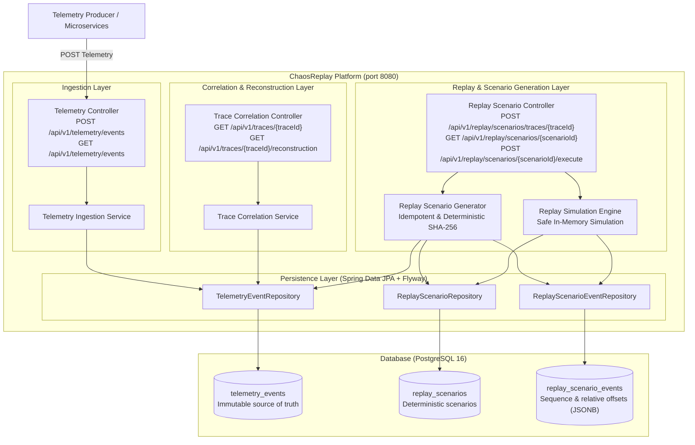

# ChaosReplay

## Overview

ChaosReplay is designed to become an end-to-end distributed failure reconstruction and fix-verification platform. Modern microservice and distributed systems suffer from rare, non-deterministic, and cascading failures that are notoriously difficult to capture, isolate, and debug.

ChaosReplay's long-term vision is to automatically ingest distributed runtime telemetry, correlate cross-service events into deterministic execution timelines, reconstruct production incidents into minimal reproducible failure scenarios, replay them inside isolated environments with deterministic fault injection, and verify candidate code fixes before production release.

> **Note**: ChaosReplay is being developed in deliberate engineering phases. The current codebase implements **Phase 1 — Foundation**, **Phase 2 — Telemetry Ingestion**, **Phase 3 — Telemetry Correlation & Failure Reconstruction**, and **Phase 4 — Deterministic Failure Replay & Scenario Generation**. Future capabilities (service dependency graphs, minimal reproduction engine, chaos injection, incident graphs, UI dashboards) will be built incrementally in subsequent phases.

---

## Problem

Reproducing production bugs and catastrophic incidents in distributed systems is one of the hardest problems in software engineering:

1. **Non-Deterministic Concurrency**: Many failures occur only under specific race conditions, network latency spikes, or cross-service event orderings that cannot be reproduced on local developer machines.
2. **Cascading State Corruption**: A failure in an upstream dependency often propagates silently through messaging queues and caches, surfacing symptoms in completely unrelated downstream services.
3. **Environment Parity Gaps**: Staging environments rarely replicate the traffic volume, data topology, or network dynamics required to trigger transient edge-case failures.
4. **Verification Uncertainty**: Developers attempting to fix complex distributed bugs lack a reliable method to prove that a candidate patch genuinely solves the failure mode without introducing subtle regressions under identical fault conditions.

---

## Current Status

**Current Status: Phase 4 — Deterministic Failure Replay & Scenario Generation**

Phase 4 introduces the first replay-oriented capability of ChaosReplay — translating reconstructed production telemetry into deterministic, executable replay scenarios and executing them in safe simulation mode:

* **Telemetry-Derived Replay Scenarios**: Converts historical telemetry traces into isolated, immutable replay scenario models without modifying original telemetry events.
* **Deterministic Scenario Identity**: Scenario IDs are computed deterministically via SHA-256 over the source trace ID and ordered event sequence (`scen-<32-char-hex>`). Identical trace executions always yield identical scenario identifiers.
* **Idempotent Scenario Generation**: Generating a scenario for an existing trace returns `200 OK` with the existing scenario, preventing duplicate records. Fresh scenarios return `201 Created`.
* **Relative Timing Preservation**: Events preserve relative offset latencies (`offset_ms = event.timestamp - start_time`) rather than brittle wall-clock timestamps.
* **Deterministic Sequence Ordering**: Preserves the established `timestamp ASC, event_id ASC` tie-breaker order assigned with 1-based sequential indices (`sequence_number`).
* **Strict Simulation-Only Execution**: Replay execution processes stored event snapshots sequentially without making real external HTTP requests, invoking cloud APIs, calling databases, or sleeping on wall-clock offsets.
* **Flyway V2 Migration**: Version-controlled `V2__create_replay_scenarios.sql` adding `replay_scenarios` and `replay_scenario_events` tables with foreign keys, unique sequence constraints, and JSONB metadata.
* **Comprehensive Automated Tests**: 74 automated tests spanning unit tests (Mockito), MVC slice tests (`@WebMvcTest`), and real PostgreSQL 16 Testcontainers integration tests.

---

## Architecture

The end-to-end processing pipeline in Phase 4 is:



---

## Replay Concepts & Design

### 1. Why Replay Scenarios Exist
Telemetry events are high-volume, append-only historical records. Replay scenarios are structured, deterministic execution blueprints derived from specific incident traces. They provide:
- A self-contained execution package with all metadata and parameters preserved.
- Normalized relative offsets (`offset_ms`) independent of original calendar dates/times.
- Predictable sequence numbering for deterministic step-by-step playback.

### 2. Immutability & Separation of Concerns
`TelemetryEvent` records are strictly immutable. Scenario generation creates independent `ReplayScenario` and `ReplayScenarioEvent` records, guaranteeing that simulation replays never alter telemetry audit trails.

### 3. Deterministic Scenario Identification
Scenario IDs are generated via SHA-256 over the source trace ID and ordered event timestamps/IDs:
$$\text{scenarioId} = \text{"scen-"} + \text{hex}(\text{SHA-256}(\text{traceId} : \text{eventId}_1@t_1, \dots))[0..32]$$
This guarantees that identical telemetry sequences always produce the exact same scenario ID, enabling idempotent creation and cache-safe retrieval.

### 4. Safety Guarantees
Step 4 replay is **strictly simulation-only**:
- **No Network Calls**: Replay never sends HTTP requests, gRPC calls, or socket connections to external systems.
- **No Command Execution**: Metadata payloads are treated purely as passive data; no scripting or dynamic expression evaluation is permitted.
- **No Wall-Clock Blocking**: Replay processes relative offsets sequentially without invoking `Thread.sleep()`.
- **No Database Corruption**: Replay only updates scenario execution status (`CREATED -> RUNNING -> COMPLETED`).

---

## Database Schema (Flyway V1 & V2)

### `replay_scenarios`
```sql
CREATE TABLE replay_scenarios (
    id BIGSERIAL PRIMARY KEY,
    scenario_id VARCHAR(64) NOT NULL UNIQUE,
    source_trace_id VARCHAR(64) NOT NULL,
    created_at TIMESTAMPTZ NOT NULL DEFAULT CURRENT_TIMESTAMP,
    event_count INT NOT NULL,
    failure_count INT NOT NULL,
    duration_ms BIGINT NOT NULL,
    status VARCHAR(32) NOT NULL
);

CREATE INDEX idx_replay_scenarios_source_trace_id ON replay_scenarios (source_trace_id);
```

### `replay_scenario_events`
```sql
CREATE TABLE replay_scenario_events (
    id BIGSERIAL PRIMARY KEY,
    scenario_id VARCHAR(64) NOT NULL REFERENCES replay_scenarios (scenario_id) ON DELETE CASCADE,
    event_id VARCHAR(64) NOT NULL,
    offset_ms BIGINT NOT NULL,
    sequence_number INT NOT NULL,
    service_name VARCHAR(100) NOT NULL,
    service_instance VARCHAR(100),
    event_type VARCHAR(32) NOT NULL,
    severity VARCHAR(20) NOT NULL,
    trace_id VARCHAR(64),
    request_id VARCHAR(64),
    operation VARCHAR(255),
    message TEXT,
    metadata JSONB,

    CONSTRAINT uq_replay_scenario_events_scenario_seq UNIQUE (scenario_id, sequence_number)
);

CREATE INDEX idx_replay_scenario_events_scenario_seq ON replay_scenario_events (scenario_id, sequence_number);
```

---

## API Reference

### 1. Generate Replay Scenario

Generates a deterministic replay scenario from a reconstructed trace. Idempotent: returns `201 Created` on first generation, `200 OK` on subsequent requests.

* **Endpoint**: `POST /api/v1/replay/scenarios/traces/{traceId}`
* **Response Codes**: `201 Created`, `200 OK` (idempotent), `404 Not Found` (trace missing)

**Example Request**:
```bash
curl -X POST http://localhost:8080/api/v1/replay/scenarios/traces/trace-123
```

**Response (`201 Created` / `200 OK`)**:
```json
{
  "scenarioId": "scen-d7da823e1f70b71ed6008dff2edc30cd",
  "sourceTraceId": "trace-123",
  "createdAt": "2026-09-23T14:59:47.379316Z",
  "eventCount": 3,
  "failureCount": 1,
  "durationMs": 2000,
  "status": "CREATED",
  "events": [
    {
      "sequenceNumber": 1,
      "eventId": "evt-001",
      "offsetMs": 0,
      "serviceName": "api-gateway",
      "serviceInstance": "gw-01",
      "eventType": "REQUEST",
      "severity": "INFO",
      "traceId": "trace-123",
      "requestId": "req-456",
      "operation": "POST /checkout",
      "message": "Incoming checkout request",
      "metadata": null
    },
    {
      "sequenceNumber": 2,
      "eventId": "evt-002",
      "offsetMs": 1000,
      "serviceName": "order-service",
      "serviceInstance": "ord-01",
      "eventType": "REQUEST",
      "severity": "INFO",
      "traceId": "trace-123",
      "requestId": "req-456",
      "operation": "POST /orders",
      "message": "Validating order",
      "metadata": null
    },
    {
      "sequenceNumber": 3,
      "eventId": "evt-003",
      "offsetMs": 2000,
      "serviceName": "payment-service",
      "serviceInstance": "pay-01",
      "eventType": "EXTERNAL_CALL",
      "severity": "ERROR",
      "traceId": "trace-123",
      "requestId": "req-456",
      "operation": "POST /charge",
      "message": "Payment provider timeout",
      "metadata": {
        "provider": "stripe",
        "timeoutMs": 5000
      }
    }
  ]
}
```

---

### 2. Retrieve Replay Scenario

Retrieves an existing replay scenario and its ordered event snapshots.

* **Endpoint**: `GET /api/v1/replay/scenarios/{scenarioId}`
* **Response Codes**: `200 OK`, `404 Not Found`

**Example Request**:
```bash
curl http://localhost:8080/api/v1/replay/scenarios/scen-d7da823e1f70b71ed6008dff2edc30cd
```

---

### 3. Execute Replay Simulation

Executes the replay scenario in deterministic simulation mode.

* **Endpoint**: `POST /api/v1/replay/scenarios/{scenarioId}/execute`
* **Response Codes**: `200 OK`, `404 Not Found`, `409 Conflict` (if scenario is already `RUNNING`)

**Example Request**:
```bash
curl -X POST http://localhost:8080/api/v1/replay/scenarios/scen-d7da823e1f70b71ed6008dff2edc30cd/execute
```

**Response (`200 OK`)**:
```json
{
  "scenarioId": "scen-d7da823e1f70b71ed6008dff2edc30cd",
  "status": "COMPLETED",
  "startedAt": "2026-09-23T15:02:12.093179Z",
  "completedAt": "2026-09-23T15:02:12.100632Z",
  "durationMs": 7,
  "eventsProcessed": 3,
  "failuresSimulated": 1,
  "message": "Deterministic simulation replay completed successfully"
}
```

---

### 4. Retrieve Scenarios for Trace

Retrieves all scenarios generated from a specific source trace ID.

* **Endpoint**: `GET /api/v1/replay/scenarios/traces/{traceId}`
* **Response Codes**: `200 OK`

---

### 5. Telemetry & Correlation Endpoints (from Phases 1–3)

* `POST /api/v1/telemetry/events`: Ingests telemetry event (`201 Created`, `409 Conflict`).
* `GET /api/v1/telemetry/events`: Multi-criteria querying with pagination.
* `GET /api/v1/traces/{traceId}`: Correlates trace events chronologically (`200 OK`, `404 Not Found`).
* `GET /api/v1/requests/{requestId}`: Correlates ingress request events (`200 OK`, `404 Not Found`).
* `GET /api/v1/traces/{traceId}/reconstruction`: Reconstructs trace duration, failure metrics, and first failure (`200 OK`, `404 Not Found`).
* `GET /api/v1/health`: Heartbeat health check.
* `GET /actuator/health`: Production health probe reporting database connectivity.

---

## Automated Testing Suite

Run the full automated test suite (74 tests including Testcontainers PostgreSQL integration tests):

```bash
./mvnw clean test
```

### Test Hierarchy:
1. **Unit Tests**:
   - `ReplayScenarioServiceTest`: Verifies deterministic SHA-256 scenario ID generation, relative `offset_ms` computation, single-counted failure analysis, tie-breaking order preservation, and idempotency.
   - `ReplayExecutionServiceTest`: Verifies safe simulation execution, status lifecycle transitions (`CREATED -> RUNNING -> COMPLETED`), failure counting, and conflict prevention on concurrent runs.
   - `TraceCorrelationServiceTest`: Verifies trace/request correlation and failure timeline reconstruction.
   - `TelemetryServiceTest`: Verifies duplicate rejection, concurrency constraints, and query filtering.
2. **Web Slice Tests (`@WebMvcTest`)**:
   - `ReplayScenarioControllerTest`: Verifies HTTP 201/200 idempotency, 404 handling, and 409 conflict responses.
   - `TraceCorrelationControllerTest`, `RequestCorrelationControllerTest`, `TelemetryControllerTest`, `HealthControllerTest`, `ValidationTest`.
3. **Real PostgreSQL Integration Tests (`@Testcontainers`)**:
   - `ReplayPostgresIntegrationTest`: Verifies Flyway V2 migrations, foreign keys, JSONB metadata persistence, sequence uniqueness constraints, and simulation lifecycle updates against live PostgreSQL 16.
   - `CorrelationPostgresIntegrationTest`, `TelemetryPostgresIntegrationTest`.

---

## Packaging & Docker

### Package JAR:
```bash
./mvnw clean package
```

### Build Production Docker Image:
```bash
docker build -t chaosreplay:latest .
```

---

## Project Roadmap

* **Phase 1 — Foundation** *(Completed)*
* **Phase 2 — Telemetry Ingestion** *(Completed)*
* **Phase 3 — Telemetry Correlation & Failure Reconstruction** *(Completed)*
* **Phase 4 — Deterministic Failure Replay & Scenario Generation** *(Completed)*
* **Phase 5 — Service Dependency Graph** *(Upcoming)*
* **Phase 6 — Minimal Reproduction Engine** *(Upcoming)*
* **Phase 7 — Isolated Replay Engine** *(Upcoming)*
* **Phase 8 — Chaos Injection** *(Upcoming)*
* **Phase 9 — Candidate Fix Verification** *(Upcoming)*
* **Phase 10 — Observability (OTel/Prometheus/Grafana)** *(Upcoming)*
* **Phase 11 — Angular Incident Dashboard** *(Upcoming)*
* **Phase 12 — Kubernetes/AWS Deployment** *(Upcoming)*