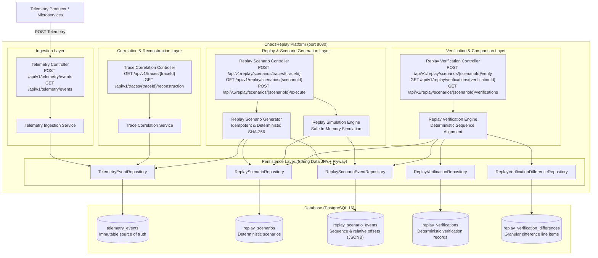

# ChaosReplay

## Overview

ChaosReplay is designed to become an end-to-end distributed failure reconstruction and fix-verification platform. Modern microservice and distributed systems suffer from rare, non-deterministic, and cascading failures that are notoriously difficult to capture, isolate, and debug.

ChaosReplay's long-term vision is to automatically ingest distributed runtime telemetry, correlate cross-service events into deterministic execution timelines, reconstruct production incidents into minimal reproducible failure scenarios, replay them inside isolated environments with deterministic fault injection, and verify candidate code fixes before production release.

> **Note**: ChaosReplay is being developed in deliberate engineering phases. The current codebase implements **Phase 1 — Foundation**, **Phase 2 — Telemetry Ingestion**, **Phase 3 — Telemetry Correlation & Failure Reconstruction**, **Phase 4 — Deterministic Failure Replay & Scenario Generation**, and **Phase 5 — Replay Verification & Failure Comparison**. Future capabilities (service dependency graphs, minimal reproduction engine, chaos injection, incident graphs, UI dashboards) will be built incrementally in subsequent phases.

---

## Problem

Reproducing production bugs and catastrophic incidents in distributed systems is one of the hardest problems in software engineering:

1. **Non-Deterministic Concurrency**: Many failures occur only under specific race conditions, network latency spikes, or cross-service event orderings that cannot be reproduced on local developer machines.
2. **Cascading State Corruption**: A failure in an upstream dependency often propagates silently through messaging queues and caches, surfacing symptoms in completely unrelated downstream services.
3. **Environment Parity Gaps**: Staging environments rarely replicate the traffic volume, data topology, or network dynamics required to trigger transient edge-case failures.
4. **Verification Uncertainty**: Developers attempting to fix complex distributed bugs lack a reliable method to prove that a candidate patch genuinely solves the failure mode without introducing subtle regressions under identical fault conditions.

---

## Current Status

**Current Status: Phase 5 — Replay Verification & Failure Comparison**

Phase 5 introduces the verification layer required to answer:

> **"Did the replay reproduce the original failure, and if not, what changed?"**

* **Evidence-Based Verification**: Compares immutable scenario snapshots against simulated observations without guessing root causes.
* **Deterministic Verification Identity**: Verification IDs are computed deterministically via SHA-256 over the scenario ID, duration, ordered expected events, and ordered observed events (`verify-<32-char-hex>`).
* **Idempotent Verification**: Verifying the same scenario and observations returns `200 OK` with the existing verification record. Fresh verifications return `201 Created`.
* **Explicit Difference Classification**: Sequences are aligned and compared across services, event types, severities, and event ordering to detect:
  * `MISSING_EVENT`: Expected event not observed in the replay.
  * `UNEXPECTED_EVENT`: Extraneous event observed during replay without an expected counterpart.
  * `SERVICE_MISMATCH`: Execution occurred on a different service.
  * `EVENT_TYPE_MISMATCH`: Ingress or interaction type differed (e.g. `REQUEST` vs `RESPONSE`).
  * `SEVERITY_MISMATCH`: Severity differed (e.g. `ERROR` vs `WARN`).
  * `EVENT_ORDER_MISMATCH`: Events were emitted out of deterministic sequence order.
* **Rigorous Verification Rules**:
  * **`PASSED`**: All events matched, zero missing/unexpected events, zero mismatches, and exact original failure count reproduced.
  * **`FAILED`**: Material departure from failure behavior — failure count difference, missing events, service mismatches, event type mismatches, or critical severity shifts (`ERROR`/`FATAL` vs non-error).
  * **`PARTIAL`**: Failure count and core services/types matched, but non-critical differences occurred (such as `INFO` to `DEBUG` severity adjustments or non-failure drift).
* **Simulation-Only Safety**: Strictly zero external network calls, zero third-party API invocations, and immutable historical records.
* **Flyway V3 Migration**: Version-controlled `V3__create_replay_verifications.sql` establishing `replay_verifications` and `replay_verification_differences` with foreign key cascade deletion and indexes.
* **Comprehensive Automated Tests**: 102 automated tests spanning unit tests (Mockito), MVC slice tests (`@WebMvcTest`), and real PostgreSQL 16 Testcontainers integration tests.

---

## Architecture

The end-to-end processing pipeline in Phase 5 is:



---

## Verification Flow & Decision Model

```text
Original Telemetry
       ↓
Trace Correlation
       ↓
Failure Reconstruction
       ↓
Replay Scenario (Expected Snapshots)
       ↓
Replay Simulation
       ↓
Replay Observation (Observed Events)
       ↓
Deterministic Verification Engine
       ├── Sequence Alignment
       ├── Mismatch Identification (Missing, Unexpected, Service, Type, Severity)
       └── Metric Calculation
       ↓
PASS / FAIL / PARTIAL Status
       ↓
Immutable Verification Persistence (PostgreSQL)
```

---

## Verification Endpoints (Phase 5)

### 1. Verify Replay Scenario
Verifies a simulated scenario against original telemetry. Idempotent: returns `201 Created` for fresh verifications, `200 OK` for repeated identical runs.

* **Endpoint**: `POST /api/v1/replay/scenarios/{scenarioId}/verify`
* **Response Codes**: `201 Created`, `200 OK`, `404 Not Found`

**Example Request**:
```bash
curl -i -X POST http://localhost:8080/api/v1/replay/scenarios/scen-02f5e6e297e2f440a066464a29f0a50e/verify
```

**Response (`201 Created` / `200 OK`)**:
```json
{
  "verificationId": "verify-d54f9a530b9468ff85f5611d8b168b71",
  "scenarioId": "scen-02f5e6e297e2f440a066464a29f0a50e",
  "status": "PASSED",
  "originalEventCount": 4,
  "replayedEventCount": 4,
  "originalFailureCount": 2,
  "replayedFailureCount": 2,
  "originalDurationMs": 200,
  "replayedDurationMs": 200,
  "eventsMatched": 4,
  "eventsMissing": 0,
  "eventsUnexpected": 0,
  "severityMismatches": 0,
  "eventTypeMismatches": 0,
  "serviceMismatches": 0,
  "resultMessage": "Replay verified successfully: all 4 events matched original failure characteristics",
  "createdAt": "2026-09-23T15:32:46.888986Z",
  "differences": []
}
```

---

### 2. Retrieve Verification by ID
Retrieves an existing verification record with all detailed differences.

* **Endpoint**: `GET /api/v1/replay/verifications/{verificationId}`
* **Response Codes**: `200 OK`, `404 Not Found`

**Example Request**:
```bash
curl http://localhost:8080/api/v1/replay/verifications/verify-d54f9a530b9468ff85f5611d8b168b71
```

---

### 3. Retrieve Verification History for Scenario
Retrieves all verification attempts for a specific scenario ordered by creation time descending.

* **Endpoint**: `GET /api/v1/replay/scenarios/{scenarioId}/verifications`
* **Response Codes**: `200 OK`, `404 Not Found`

**Example Request**:
```bash
curl http://localhost:8080/api/v1/replay/scenarios/scen-02f5e6e297e2f440a066464a29f0a50e/verifications
```

---

## Replay & Scenario Endpoints (Phase 4)

* `POST /api/v1/replay/scenarios/traces/{traceId}`: Generates deterministic scenario (`201 Created`, `200 OK`, `404 Not Found`).
* `GET /api/v1/replay/scenarios/{scenarioId}`: Retrieves replay scenario (`200 OK`, `404 Not Found`).
* `POST /api/v1/replay/scenarios/{scenarioId}/execute`: Executes safe simulation (`200 OK`, `404 Not Found`, `409 Conflict`).
* `GET /api/v1/replay/scenarios/traces/{traceId}`: Retrieves all scenarios for a trace (`200 OK`).

---

## Telemetry & Correlation Endpoints (Phases 1–3)

* `POST /api/v1/telemetry/events`: Ingests telemetry event (`201 Created`, `409 Conflict`).
* `GET /api/v1/telemetry/events`: Multi-criteria querying with pagination.
* `GET /api/v1/traces/{traceId}`: Correlates trace events chronologically (`200 OK`, `404 Not Found`).
* `GET /api/v1/requests/{requestId}`: Correlates ingress request events (`200 OK`, `404 Not Found`).
* `GET /api/v1/traces/{traceId}/reconstruction`: Reconstructs trace duration, failure metrics, and first failure (`200 OK`, `404 Not Found`).
* `GET /api/v1/health`: Heartbeat health check.
* `GET /actuator/health`: Production health probe reporting database connectivity.

---

## Automated Testing Suite

Run the full automated test suite (102 tests including Testcontainers PostgreSQL integration tests):

```bash
./mvnw clean test
```

### Test Hierarchy:
1. **Unit Tests**:
   - `ReplayVerificationServiceTest`: 16 comprehensive unit tests covering PASSED, FAILED (missing events, unexpected events, severity mismatch, event type mismatch, service mismatch, failure count drift), PARTIAL (non-critical severity differences), deterministic SHA-256 ID consistency, idempotency, and scenario immutability.
   - `ReplayScenarioServiceTest`: Deterministic SHA-256 scenario ID generation, relative `offset_ms` computation, single-counted failure analysis, tie-breaking order preservation, and idempotency.
   - `ReplayExecutionServiceTest`: Safe simulation execution, status lifecycle transitions (`CREATED -> RUNNING -> COMPLETED`), failure counting, and conflict prevention on concurrent runs.
   - `TraceCorrelationServiceTest`: Trace/request correlation and failure timeline reconstruction.
   - `TelemetryServiceTest`: Duplicate rejection, concurrency constraints, and query filtering.
2. **Web Slice Tests (`@WebMvcTest`)**:
   - `ReplayVerificationControllerTest`: Verifies HTTP 201/200 idempotency, 404 handling, and verification history listing.
   - `ReplayScenarioControllerTest`: HTTP 201/200 idempotency, 404 handling, and 409 conflict responses.
   - `TraceCorrelationControllerTest`, `RequestCorrelationControllerTest`, `TelemetryControllerTest`, `HealthControllerTest`, `ValidationTest`.
3. **Real PostgreSQL Integration Tests (`@Testcontainers`)**:
   - `ReplayVerificationPostgresIntegrationTest`: Verifies Flyway V3 migration, verification persistence, difference persistence, foreign-key cascade deletion, unique constraints, and end-to-end verification against live PostgreSQL 16.
   - `ReplayPostgresIntegrationTest`: Flyway V2 migrations, foreign keys, JSONB metadata persistence, sequence uniqueness constraints, and simulation lifecycle updates.
   - `CorrelationPostgresIntegrationTest`, `TelemetryPostgresIntegrationTest`.

---

## Packaging & Docker

### Package JAR:
```bash
./mvnw clean package
```

### Build Production Docker Image:
```bash
docker build -t chaosreplay:latest .
```

---

## Project Roadmap

* **Phase 1 — Foundation** *(Completed)*
* **Phase 2 — Telemetry Ingestion** *(Completed)*
* **Phase 3 — Telemetry Correlation & Failure Reconstruction** *(Completed)*
* **Phase 4 — Deterministic Failure Replay & Scenario Generation** *(Completed)*
* **Phase 5 — Replay Verification & Failure Comparison** *(Completed)*
* **Phase 6 — Service Dependency Graph** *(Upcoming)*
* **Phase 7 — Minimal Reproduction Engine** *(Upcoming)*
* **Phase 8 — Isolated Replay Engine** *(Upcoming)*
* **Phase 9 — Chaos Injection** *(Upcoming)*
* **Phase 10 — Candidate Fix Verification** *(Upcoming)*
* **Phase 11 — Observability (OTel/Prometheus/Grafana)** *(Upcoming)*
* **Phase 12 — Angular Incident Dashboard** *(Upcoming)*
* **Phase 13 — Kubernetes/AWS Deployment** *(Upcoming)*